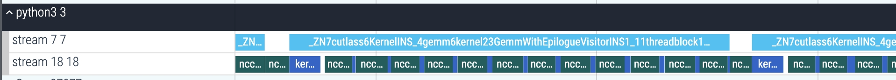

<div align="center">

# ***FlashOverlap*** 

<a href="https://arxiv.org/abs/2504.19519">
    </a>
<a href="https://zhuanlan.zhihu.com/p/1897633068380054002?share_code=1nCLEM5AgyjRb&utm_psn=1900536763014963236&utm_source=wechat_timeline&utm_medium=social&s_r=0">
    </a>

😊 **A Lightweight Design for Computation-Communication Overlap**
</div>
This is the artifact of paper "Efficient and Adaptable Overlapping for Computation and Communication via Signaling and Reordering" accepted by EuroSys'26.

## How *FlashOverlap* Works

The figure shows a typical timeline of computation-communication overlap in FlashOverlap. Two CUDA streams are for computation and communication, respectively. The CUTLASS kernel sends signals during GEMM computation in one stream, while a counting kernel stalls NCCL communication until receiving a preset number of signals in the other stream.

## Build and Install
### Dependency
The main dependency is [NCCL](https://developer.nvidia.com/nccl/nccl-download), which *FlashOverlap* uses for communication. It is convenient to download from the official website. The code has been tested with `v2.18.3` and `v2.19.3`. 

Another dependency is [CUTLASS](https://github.com/NVIDIA/cutlass.git), which is included as submodule. Note that the code has been tested with `v3.6.0` and `v3.9.0`, but fails with `v3.4.0`. We assume `CUTLASS>=v3.6.0` works fine.  

The code only supports `sm_80, sm_86, sm_89` now, and the evaluation enviroments include NVIDIA RTX 3090, RTX 4090, A800, and A100 GPUs. This artifact evaluation necessitates a server equipped with eight GPUs. Please contact the authors for the lack of such enviroments. The versions of CUDA Toolkit include `CUDA 12.1, 12.2`.

### Install
First, pull the repo:

```shell
    $ git clone https://github.com/infinigence/FlashOverlap.git -b ae
    $ cd FlashOverlap
    $ git submodule update --init --recursive
```
Install PyTorch and other required packages through `pip` or `conda`:
```shell
    $ pip install torch==2.5.1 torchvision==0.20.1 torchaudio==2.5.1 --index-url https://download.pytorch.org/whl/cu121
    $ pip install numpy==2.1.2, pandas==2.2.3, setuptools==75.8.0
```

Before compiling, generate the GEMM instances:
```shell
    $ mkdir ./configs
    $ cd ./tool
    $ python generate_instances.py
```

This repo uses cmake (>=3.18) for compiling:

```shell
    $ cmake -B build
    $ cmake --build build -j
```
Then the operators are registered as torch.class, and in Python code, the `.so` should be included whenever the operators are used.
```python
    torch.ops.load_library("../build/lib/libst_pybinding.so")
```

## Setup
Before evaluation, we need to first generate the GEMM configurations, and then tune the overlap performance. We have prepared a script that automates the entire setup procedure.
 
```shell
    $ cd tune
    $ python3 preparation.py
```

## Experiment 1
To verify the output correctness, run the corresponding script and the terminal will outputs `all close`.
```shell
    $ cd ../evaluation
    $ python3 e1_correctness.py
```

To show the overlap speedup, run the corresponding script and the terminal will outputs a table showing speedups across different primitives and GPU numbers.
```shell
    $ cd ../evaluation
    $ python3 e1_speedup.py
```

If the GPUs enable peer-to-peer access, the baselines include [Flux](https://github.com/bytedance/flux) and [AsyncTP](https://discuss.pytorch.org/t/distributed-w-torchtitan-introducing-async-tensor-parallelism-in-pytorch/209487) can be run. To compare the performance of GEMM + ReduceScatter, follow the instructions in the offical repository of [Flux](https://github.com/bytedance/flux) and run the two baselines separately. After that, run the provided script to show the comparison results. 
```shell
    $ cd baseline
    $ python3 async_tp_test.py
    $ python3 flux_test.py
    $ python3 e1_rs_compare.py
```

## Experiment 2
To evaluate the search accuracy of the proposed predictive search method, run the script and the terminal will output (1) the cumulative distribution curve of the average prediction error and (2) the performance comparison between the predictive searched solution and the exhaustive searched solution.
```shell
    $ cd ..
    $ python3 e2_predictive_search.py
```

## Experiment 3
To quantify the overhead in the RMSNorm kernel, run the following script and the terminal will output the overhead ratio under different patterns.
```shell
    $ cd ..
    $ python3 e3_rmsnorm_overhead.py
```

To quantify the overhead in the GEMM kernel, run the following script and the terminal will output the overhead ratio under different patterns.
```shell
    $ cd ..
    $ python3 e3_gemm_overhead.py
```

## Contact
Please contact `hk24@mails.tsinghua.edu.cn` for further issues. 
